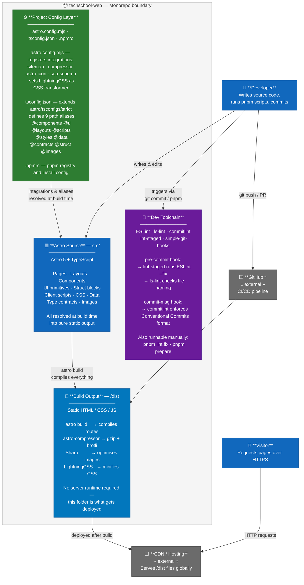

```mermaid
flowchart TD
    DEV["👤 **Developer**\nWrites source code,\nruns pnpm scripts, commits"]

    subgraph REPO["📦 techschool-web — Monorepo boundary"]
        direction TD

        CFG["⚙️ **Project Config Layer**\n──────────────\nastro.config.mjs · tsconfig.json · .npmrc\n\nastro.config.mjs — registers integrations:\n  sitemap · compressor · astro-icon · seo-schema\n  sets LightningCSS as CSS transformer\n\ntsconfig.json — extends astro/tsconfigs/strict\n  defines 9 path aliases:\n  @components @ui @layouts @scripts\n  @styles @data @contracts @struct @images\n\n.npmrc — pnpm registry and install config"]

        TOOL["🔧 **Dev Toolchain**\n──────────────\nESLint · ls-lint · commitlint\nlint-staged · simple-git-hooks\n\npre-commit hook:\n  → lint-staged runs ESLint --fix\n  → ls-lint checks file naming\n\ncommit-msg hook:\n  → commitlint enforces\n    Conventional Commits format\n\nAlso runnable manually:\n  pnpm lint:fix · pnpm prepare"]

        SRC["🟦 **Astro Source** — src/\n──────────────\nAstro 5 + TypeScript\n\nPages · Layouts · Components\nUI primitives · Struct blocks\nClient scripts · CSS · Data\nType contracts · Images\n\nAll resolved at build time\ninto pure static output"]

        DIST["📄 **Build Output** — /dist\n──────────────\nStatic HTML / CSS / JS\n\nastro build    → compiles routes\nastro-compressor → gzip + brotli\nSharp          → optimises images\nLightningCSS   → minifies CSS\n\nNo server runtime required —\nthis folder is what gets deployed"]
    end

    CDN["⬜ **CDN / Hosting**\n« external »\nServes /dist files globally"]
    VISITOR["👤 **Visitor**\nRequests pages over HTTPS"]
    GH["⬜ **GitHub**\n« external »\nCI/CD pipeline"]

    DEV -->|"writes & edits"| SRC
    DEV -->|"triggers via\ngit commit / pnpm"| TOOL
    CFG -->|"integrations & aliases\nresolved at build time"| SRC
    SRC -->|"astro build\ncompiles everything"| DIST
    DIST -->|"deployed after build"| CDN
    VISITOR -->|"HTTP requests"| CDN
    DEV -->|"git push / PR"| GH
    GH -->|"CI runs build\nand deploy"| DIST

    style DEV fill:#1168BD,color:#fff,stroke:#0e56a0
    style VISITOR fill:#1168BD,color:#fff,stroke:#0e56a0
    style CFG fill:#2E7D32,color:#fff,stroke:#1b5e20
    style TOOL fill:#6A1B9A,color:#fff,stroke:#4a148c
    style SRC fill:#1168BD,color:#fff,stroke:#0e56a0
    style DIST fill:#0277BD,color:#fff,stroke:#01579b
    style CDN fill:#6b6b6b,color:#fff,stroke:#444
    style GH fill:#6b6b6b,color:#fff,stroke:#444
    style REPO fill:#f5f5f5,stroke:#bbb,color:#333
```
