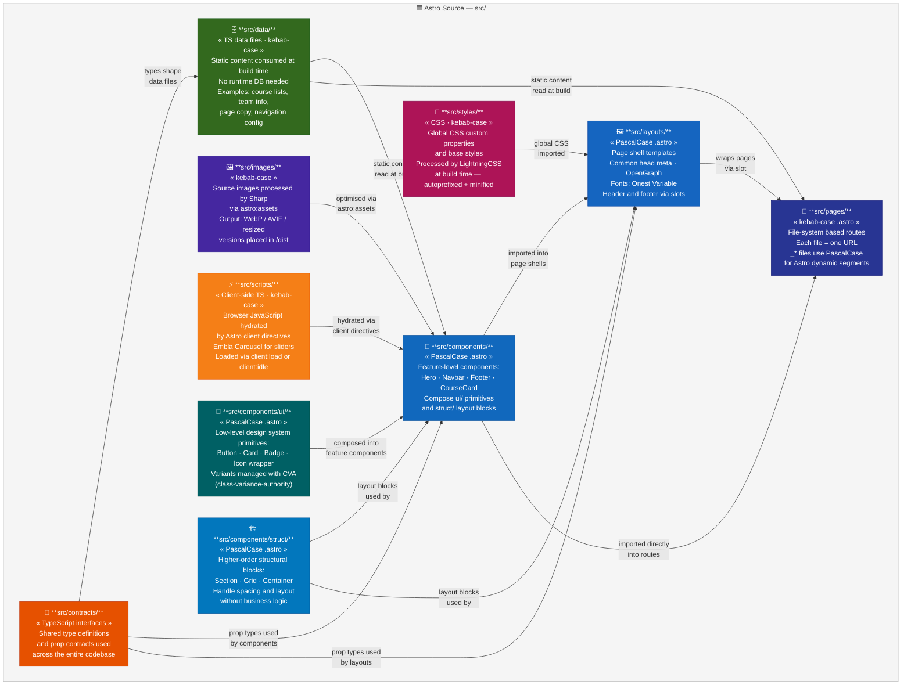

```mermaid
flowchart TD
    subgraph SRC["🟦 Astro Source — src/"]
        CONTRACTS["📐 **src/contracts/**\n« TypeScript interfaces »\nShared type definitions\nand prop contracts used\nacross the entire codebase"]

        DATA["🗄️ **src/data/**\n« TS data files · kebab-case »\nStatic content consumed at build time\nNo runtime DB needed\nExamples: course lists, team info,\npage copy, navigation config"]

        IMAGES["🖼️ **src/images/**\n« kebab-case »\nSource images processed by Sharp\nvia astro:assets\nOutput: WebP / AVIF / resized\nversions placed in /dist"]

        STYLES["🎨 **src/styles/**\n« CSS · kebab-case »\nGlobal CSS custom properties\nand base styles\nProcessed by LightningCSS\nat build time — autoprefixed + minified"]

        SCRIPTS["⚡ **src/scripts/**\n« Client-side TS · kebab-case »\nBrowser JavaScript hydrated\nby Astro client directives\nEmbla Carousel for sliders\nLoaded via client:load or client:idle"]

        UI["🧩 **src/components/ui/**\n« PascalCase .astro »\nLow-level design system primitives:\nButton · Card · Badge · Icon wrapper\nVariants managed with CVA\n(class-variance-authority)"]

        STRUCT["🏗️ **src/components/struct/**\n« PascalCase .astro »\nHigher-order structural blocks:\nSection · Grid · Container\nHandle spacing and layout\nwithout business logic"]

        COMPONENTS["🧱 **src/components/**\n« PascalCase .astro »\nFeature-level components:\nHero · Navbar · Footer · CourseCard\nCompose ui/ primitives\nand struct/ layout blocks"]

        LAYOUTS["🖼️ **src/layouts/**\n« PascalCase .astro »\nPage shell templates\nCommon head meta · OpenGraph\nFonts: Onest Variable\nHeader and footer via slots"]

        PAGES["📄 **src/pages/**\n« kebab-case .astro »\nFile-system based routes\nEach file = one URL\n_* files use PascalCase\nfor Astro dynamic segments"]
    end

    CONTRACTS -->|"types shape\ndata files"| DATA
    CONTRACTS -->|"prop types used\nby components"| COMPONENTS
    CONTRACTS -->|"prop types used\nby layouts"| LAYOUTS
    DATA -->|"static content\nread at build"| COMPONENTS
    DATA -->|"static content\nread at build"| PAGES
    IMAGES -->|"optimised via\nastro:assets"| COMPONENTS
    STYLES -->|"global CSS\nimported"| LAYOUTS
    SCRIPTS -->|"hydrated via\nclient directives"| COMPONENTS
    UI -->|"composed into\nfeature components"| COMPONENTS
    STRUCT -->|"layout blocks\nused by"| COMPONENTS
    STRUCT -->|"layout blocks\nused by"| LAYOUTS
    COMPONENTS -->|"imported into\npage shells"| LAYOUTS
    COMPONENTS -->|"imported directly\ninto routes"| PAGES
    LAYOUTS -->|"wraps pages\nvia slot"| PAGES

    style CONTRACTS fill:#E65100,color:#fff,stroke:#bf360c
    style DATA fill:#33691E,color:#fff,stroke:#1b5e20
    style IMAGES fill:#4527A0,color:#fff,stroke:#311b92
    style STYLES fill:#AD1457,color:#fff,stroke:#880e4f
    style SCRIPTS fill:#F57F17,color:#fff,stroke:#e65100
    style UI fill:#006064,color:#fff,stroke:#004d40
    style STRUCT fill:#0277BD,color:#fff,stroke:#01579b
    style COMPONENTS fill:#1168BD,color:#fff,stroke:#0e56a0
    style LAYOUTS fill:#1565C0,color:#fff,stroke:#0d47a1
    style PAGES fill:#283593,color:#fff,stroke:#1a237e
    style SRC fill:#f5f5f5,stroke:#bbb,color:#333
```
