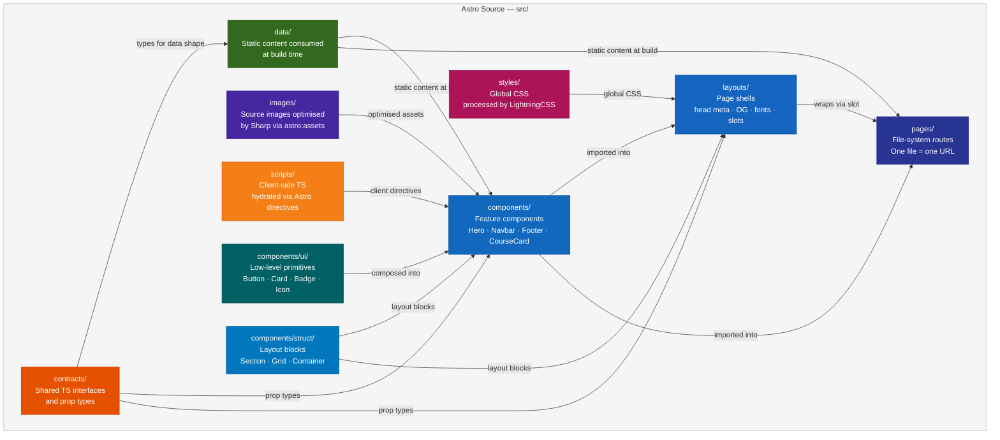

```mermaid
flowchart TD
    subgraph SRC["Astro Source — src/"]
        CONTRACTS["contracts/\nShared TS interfaces\nand prop types"]
        DATA["data/\nStatic content consumed\nat build time"]
        IMAGES["images/\nSource images optimised\nby Sharp via astro:assets"]
        STYLES["styles/\nGlobal CSS\nprocessed by LightningCSS"]
        SCRIPTS["scripts/\nClient-side TS\nhydrated via Astro directives"]
        UI["components/ui/\nLow-level primitives\nButton · Card · Badge · Icon"]
        STRUCT["components/struct/\nLayout blocks\nSection · Grid · Container"]
        COMPONENTS["components/\nFeature components\nHero · Navbar · Footer · CourseCard"]
        LAYOUTS["layouts/\nPage shells\nhead meta · OG · fonts · slots"]
        PAGES["pages/\nFile-system routes\nOne file = one URL"]
    end

    CONTRACTS -->|"types for data shape"| DATA
    CONTRACTS -->|"prop types"| COMPONENTS
    CONTRACTS -->|"prop types"| LAYOUTS
    DATA -->|"static content at build"| COMPONENTS
    DATA -->|"static content at build"| PAGES
    IMAGES -->|"optimised assets"| COMPONENTS
    STYLES -->|"global CSS"| LAYOUTS
    SCRIPTS -->|"client directives"| COMPONENTS
    UI -->|"composed into"| COMPONENTS
    STRUCT -->|"layout blocks"| COMPONENTS
    STRUCT -->|"layout blocks"| LAYOUTS
    COMPONENTS -->|"imported into"| LAYOUTS
    COMPONENTS -->|"imported into"| PAGES
    LAYOUTS -->|"wraps via slot"| PAGES

    style CONTRACTS fill:#E65100,color:#fff,stroke:#bf360c
    style DATA fill:#33691E,color:#fff,stroke:#1b5e20
    style IMAGES fill:#4527A0,color:#fff,stroke:#311b92
    style STYLES fill:#AD1457,color:#fff,stroke:#880e4f
    style SCRIPTS fill:#F57F17,color:#fff,stroke:#e65100
    style UI fill:#006064,color:#fff,stroke:#004d40
    style STRUCT fill:#0277BD,color:#fff,stroke:#01579b
    style COMPONENTS fill:#1168BD,color:#fff,stroke:#0e56a0
    style LAYOUTS fill:#1565C0,color:#fff,stroke:#0d47a1
    style PAGES fill:#283593,color:#fff,stroke:#1a237e
    style SRC fill:#f5f5f5,stroke:#bbb,color:#333
```
