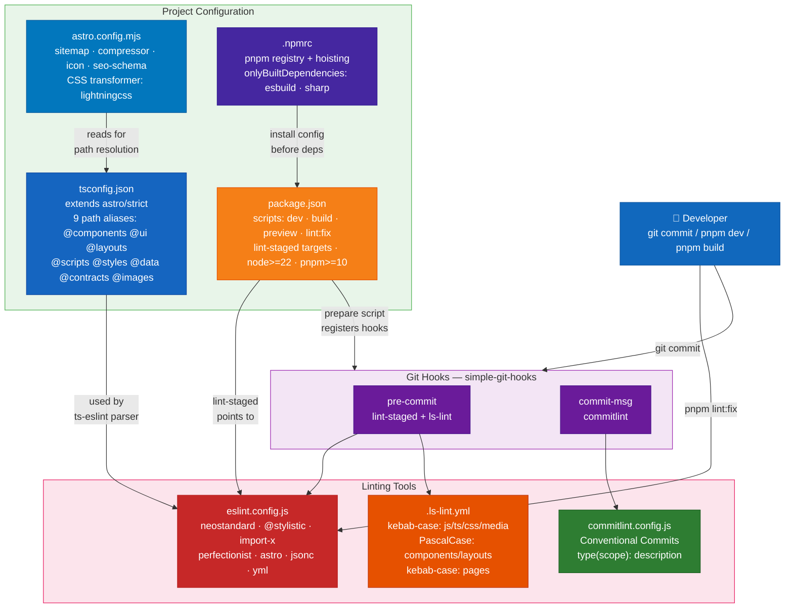

```mermaid
flowchart TD
    DEV["👤 Developer\ngit commit / pnpm dev / pnpm build"]

    subgraph HOOKS["Git Hooks — simple-git-hooks"]
        PRECOMMIT["pre-commit\nlint-staged + ls-lint"]
        COMMITMSG["commit-msg\ncommitlint"]
    end

    subgraph LINTERS["Linting Tools"]
        ESLINT["eslint.config.js\nneostandard · @stylistic · import-x\nperfectionist · astro · jsonc · yml"]
        LSLINT[".ls-lint.yml\nkebab-case: js/ts/css/media\nPascalCase: components/layouts\nkebab-case: pages"]
        COMMITLINT["commitlint.config.js\nConventional Commits\ntype(scope): description"]
    end

    subgraph CFGFILES["Project Configuration"]
        PKGJSON["package.json\nscripts: dev · build · preview · lint:fix\nlint-staged targets · node>=22 · pnpm>=10"]
        ASTROCFG["astro.config.mjs\nsitemap · compressor · icon · seo-schema\nCSS transformer: lightningcss"]
        TSCFG["tsconfig.json\nextends astro/strict\n9 path aliases: @components @ui @layouts\n@scripts @styles @data @contracts @images"]
        NPMRC[".npmrc\npnpm registry + hoisting\nonlyBuiltDependencies: esbuild · sharp"]
    end

    DEV -->|"git commit"| HOOKS
    DEV -->|"pnpm lint:fix"| ESLINT
    PKGJSON -->|"prepare script\nregisters hooks"| HOOKS
    PKGJSON -->|"lint-staged\npoints to"| ESLINT
    PRECOMMIT --> ESLINT
    PRECOMMIT --> LSLINT
    COMMITMSG --> COMMITLINT
    ASTROCFG -->|"reads for\npath resolution"| TSCFG
    TSCFG -->|"used by\nts-eslint parser"| ESLINT
    NPMRC -->|"install config\nbefore deps"| PKGJSON

    style DEV fill:#1168BD,color:#fff,stroke:#0e56a0
    style PRECOMMIT fill:#6A1B9A,color:#fff,stroke:#4a148c
    style COMMITMSG fill:#6A1B9A,color:#fff,stroke:#4a148c
    style ESLINT fill:#C62828,color:#fff,stroke:#b71c1c
    style LSLINT fill:#E65100,color:#fff,stroke:#bf360c
    style COMMITLINT fill:#2E7D32,color:#fff,stroke:#1b5e20
    style PKGJSON fill:#F57F17,color:#fff,stroke:#e65100
    style ASTROCFG fill:#0277BD,color:#fff,stroke:#01579b
    style TSCFG fill:#1565C0,color:#fff,stroke:#0d47a1
    style NPMRC fill:#4527A0,color:#fff,stroke:#311b92
    style HOOKS fill:#f3e5f5,stroke:#9c27b0,color:#333
    style LINTERS fill:#fce4ec,stroke:#e91e63,color:#333
    style CFGFILES fill:#e8f5e9,stroke:#4caf50,color:#333
```
